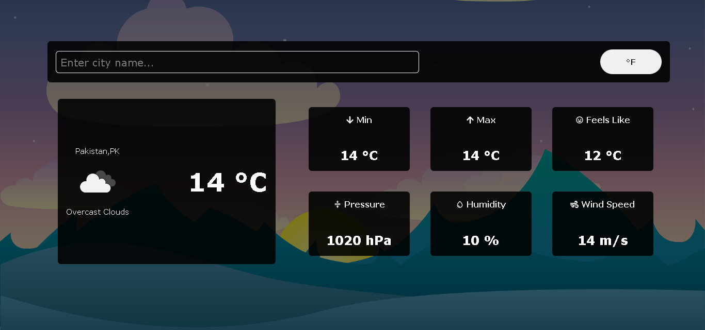

# Weather App

Welcome to the Weather App, a simple and intuitive application built with React.js that allows users to check live weather details using the OpenWeatherMap API. This README will guide you through the installation, setup, and usage of the Weather App.

 [Live Demo](https://weather-app-041.netlify.app/)

 

## Table of Contents

- [Installation](#installation)
- [Setup](#setup)
- [Usage](#usage)
- [Features](#features)
- [Contributing](#contributing)
- [License](#license)

## Installation

To get started, follow these steps:

1. Clone the repository to your local machine:

```bash
git clone https://github.com/ayeshasikander/Weather-app.git
```

2. Change into the project directory:

```bash
cd weather-app
```

3. Install the required dependencies using npm:

```bash
npm install
```

## Setup

Before you can use the Weather App, you need to obtain an API key from [OpenWeatherMap](https://openweathermap.org/api) to access their weather data. Once you have the API key, create a file named `.env` in the project root and add the following line, replacing `YOUR_API_KEY` with your actual API key:

```env
REACT_APP_API_KEY=YOUR_API_KEY
```

Make sure to keep your API key confidential and do not expose it publicly.

## Usage

To start the Weather App, run the following command:

```bash
npm start
```

This will launch the application in your default web browser. You can then enter the name of a city in the search bar to get live weather details for that location.

## Features

- **Live Weather Data**: Retrieve up-to-date weather information using the OpenWeatherMap API.

## Contributing

If you would like to contribute to the Weather App, please follow these steps:

1. Fork the repository.
2. Create a new branch for your feature or bug fix.
3. Make your changes and commit them.
4. Push your branch to your fork.
5. Submit a pull request.

Please make sure to follow the existing coding style and include tests if applicable.

## License

This project is licensed under the [MIT License](LICENSE).

Feel free to reach out if you have any questions or encounter issues. Thank you for using the Weather App!